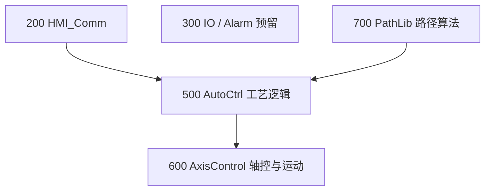

# TIA Portal 编程评审会议纪要 — SCARA 码垛项目

**日期：** 2026-05-21  
**时长：** ~41 分钟  
**记录来源：** Teams 会议转写（杨子楠 / 王硕 / 吕佩瑶）  
**项目：** `hmiDemoSCARA_ABCDE`（TIA Portal V20）

| 角色 | 姓名 | 参与内容 |
|------|------|----------|
| 开发者 | 杨子楠 (Yang Zi Nan) | 演示当前 PLC/HMI 结构与自动步 |
| 评审 | 王硕 (Wang Shuo) | 架构分层、CASE 步序、轴控与数据结构设计 |
| HMI/仿真 | 吕佩瑶 (Lv Peiyao) | Header 实时位置显示建议 |

**会议中提及（非出席）：**

| 称呼 | 姓名 |
|------|------|
| 闫老板 | 闫磊 |
| 郑老板 | 郑磊 |

**范围说明：** 本次为代码/架构评审，**不改变** Phase 2 码垛功能范围；重点是分层规范、初始化/回原、自动步 CASE 模型。

**速查清单：** [Meeting_2026-05-21_TIA_Review_Checklist.md](Meeting_2026-05-21_TIA_Review_Checklist.md)

---

## 执行摘要

1. **Home/校准：** 区分 HMI 显示的「当前 Home」与 PLC `GDB_Control` 中的 `HomePos`/`HomeMode`；仿真中易误判已回原，需单独 **FB_Init** 与正确 **HomeMode**。
2. **分层：** 轴控与运动指令归 **600**；工艺逻辑归 **500**；HMI 通信 **200**；路径算法预留 **700**。轴控必须与工艺 FB 解耦（闫老板（闫磊）要求）。
3. **运动调用：** `MC_*` / MovePath / JobFrame 不应写在 `FB_AutoCtrl_*` 内，应经 **600 轴控层** 统一调用，便于 OB 优先级与现场排障。
4. **自动步：** 采用标准 **CASE** 步号（0/10/20/30–80/50/100/200/230/800–900）；**先写参数、后发 CMD**；头尾复位。
5. **HMI：** 全局 Header 显示 **实际位置 + 目标位置**，切换 ABCDE/码垛/手动页时保持可见。

---

## 1. Home 与初始化

### 1.1 术语对照

| 名称 | 含义 | 备注 |
|------|------|------|
| **当前 Home** | HMI 上 tool tip（末端）**实时位置** | 用于校准偏移时对照 |
| **行业 Home** | PLC 校准用 **`HomePos` / `HomeMode`** | 在 `GDB_Control` 中，应归入 **Home 结构体** |
| **JogFrame** | 三轴联动 + 单轴点动 | **不要用** `MC_Jog`（轴已在 kinematics TO 内） |

### 1.2 校准与文档

- 自动模式与手动模式使用的 Home 值可能不同 → 用 **Excel** 记录映射关系。
- 会上确认：HMI Home 读数已用于对值校准，方向正确，但需书面记录。

### 1.3 仿真陷阱（重要）

- MCD/PLCSIM 可能直接取「实际位置」，**看起来像已回原**，但真机未走 `MC_Home`。
- **HomeMode 选错**会导致初始化逻辑在仿真里「通过」、现场失败。
- **对策：** 独立 **FB_Init**；真机按轴序回原；不依赖仿真绝对值冒充 Homed。

### 1.4 初始化 FB 要求

- 单独 **FB_Init**（王硕：约 80% 项目都会用到）。
- 逻辑本质是 **回原/回安全位**，不应塞在 `FB_AutoCtrl` 主序列里。
- 需定义：**各轴先后次序**、**回原速度**（可固定，可单独参数）。
- 当前缺：**完整初始化回原步骤**（含轴间顺序）。

---

## 2. 程序分层架构（200 / 300 / 500 / 600 / 700）

| 文件夹 | 职责 | 禁止事项 |
|--------|------|----------|
| **200** | HMI 通信、上位信号 | — |
| **300** | IO、报警等（预留） | — |
| **500** | 自动步、码垛、传送带、手动**逻辑** | **不得**直接调用 `MC_*`、MovePath、JobFrame |
| **600** | `FB_AxisCtrl`、`GDB_Control`、运动/kinematics 封装 | 轴控须能独立于 500 运行（OB 中先保证 600） |
| **700** | `FB_MovePath` / `GDB_MovePath`（`LKinCtrl_MovePath` 路径数据与算法） | — |

**管理要求（闫老板（闫磊））：** 轴控放在比工艺逻辑**更底层**；设备动起来先查轴控，再查 500 逻辑，避免「程序写乱导致轴不动」的误判。

**金字塔：** HMI(200) → 工艺逻辑(500) → 轴控(600)；700 向 500 提供路径数据。

---

## 3. 轴控、Kinematics 与 MovePath

> **术语：** **MovePath**（转写误作 MovePass）— 缩写自 L Kinematics 库 **`LKinCtrl_MovePath`** FB；路径数据见 `GDB_MovePath`，算法占位见 `FB_MovePath`（700 层）。

### 3.1 参考封装（王硕 ~610 区）

封装块包含约 5 类能力：

- `Enable` / `Reset` / `Home`
- **JobFrame**（点动：三轴同步 + 单轴）
- **MovePath**（路径段）
- 输出：使能、Home 完成、故障、当前段号、`MovePath` 数据 IN/OUT

**建议：** 在 kinematics 场景下 **复用 JobFrame 封装**；单轴 `MC_Jog` 易与 TO 冲突。

### 3.2 L Kinematics Control 库

- 上一阶段项目在 **900 / Motion 系统** 中用过 **L Kinematics Control**（3 个子库）。
- 王硕建议继续用；子楠需 **向郑老板（郑磊）确认** 是否允许用库（团队「不用黑盒库」政策）。

### 3.3 MovePath 与运动指令位置

| 现状 | 目标 |
|------|------|
| 自动 FB 内用 `MC_MoveLinearAbsolute` | 所有 `MC_*`/MovePath **迁至 600** |
| MovePath 在 auto 里 | MovePath **触发**在 600；**路径数据/算法**在 700 |
| Region 4 在自动 FB 内对路径指令赋值 | **赋值/发 CMD → 600**；**路径编辑与算法 → 700** |

**原则：** 工艺 FB 只写 **参数与步序**；轴控层执行运动；严格场合不允许运动指令散落在 OB 95 或 500 深处而无统一入口。

### 3.4 当前程序块分布（评审时）

- 左侧块：**自动步、码垛、皮带、轴控、手动** — 需把轴控迁出 500 逻辑区。
- **ABCD 定点** 与 **码垛/手动** 分块合理；接口与 `GDB` 对应关系需整理清晰。

---

## 4. GDB_Control 数据模型

### 4.1 结构体分类

- **数据结构决定程序可读性** — 用 **Struct 按功能分类**（如 Enable、Home、Reset），同功能多轴放**同一数组/结构**，不要扁平乱铺。
- `HomePos`、`HomeMode` 应放在 **Home 结构体** 下，不要与 Enable 等混在同一层级无分组。

### 4.2 必须修改：Enable 粒度

**现状（导出源）：** `GDB_Control.enableAxes` 为 **单 Bool 触发全轴 Enable**。

**问题：** 现场某一轴故障时，无法单独断开该轴，必须 4 轴全断。

**要求：** 改为 **分轴 Enable**（及对应 Status），与 6 轴命名习惯对齐（本项目 4 轴）。

### 4.3 避免过度集成

- 旧项目将 **Axis Control**（轴控 / **Pos Axis Ctrl**）中的点位、回原、运动等全部塞进单一 FB → **集成过多**，难维护。
- 平衡：**清晰分组** vs **单块过大**。

---

## 5. 自动步 CASE 规范（王硕模型）

> **注意：** 回原属于 **FB_Init**，不是步 50。步 50 用于 **向轴控层发运动命令（如 MovePath Start）**。

| 步号 | 用途 |
|------|------|
| **0** | 空步 / 空闲 |
| **10** | 启动**变量复位**（中间量、命令字清零；解决重启后起不来） |
| **20** | 设备运行**许可条件**（风机、泵、气缸等） |
| **30–80** | **计算** + **参数赋值**（必须在 CMD 之前） |
| **50** | 发 **MovePath Start / 运动命令** 给 600 轴控 |
| **75** | **暂停**（当前未实现 — 待做） |
| **100** | **等待循环**：卡在 100 直到运动完成；优先 `\|actual − set\| < 0.01`，慎用不可靠的 Done 脉冲 |
| **200** | **急停 / 中止** 跳转（非顺序流） |
| **230** | 本周期**结束**分支 |
| **800–900** | **停机复位**（与步 10 对称，头尾都要复位） |

**可选（高安全设备）：** 步 50/60/70 分轴再次回原（X→Y→Z 等）。

**编程原则：**

1. **先参数，后 CMD** — 否则差 1 个扫描周期，易出 bug。  
2. **头尾复位** — 启动步 10、停机步 800–900；意外停机后状态必须清掉。  
3. 步 100 完成后跳 **230**（或按工艺跳 200），**不是**死板顺序 100→200。  
4. 主逻辑用 **CASE**；`IF` 链仅适合早期调试。  
5. 子楠 **ABCD 五点点位 FB** 需改成标准 CASE（会上收尾承诺）。

### 5.1 自动 FB 区域划分（对照子楠笔记）

| 区域 | 内容 | 目标位置 |
|------|------|----------|
| Init | 初始化/许可 | 独立 **FB_Init** + 500 中调用 |
| 固定点 / ABCD | 点位逻辑 | 500，`CASE` 标准化 |
| 启动/联锁 | 上升沿、回零检查、启动/停止 | 500 |
| Region 4 | 路径指令赋值 | **600 轴控**（不是 700） |
| 路径算法 / MovePath 数据 | 屏幕编辑、轨迹计算 | **700**（`FB_MovePath` + `GDB_MovePath`） |
| 主自动步 | 码垛/工艺 CASE | 500 `FB_AutoCtrl_*` |

### 5.2 缺失功能

- **暂停（Pause）** — 王硕要求备注实现；可参考步 75 / 跳 200 模式。  
- **手动区保护** — 手动 FB 尚未写完，需补互锁。

---

## 6. HMI 反馈（吕佩瑶 + 王硕）

| 项 | 要求 |
|----|------|
| **Header 常驻** | 所有 UBP 页顶部显示 **实际位置 + 目标位置** |
| **切换页面不丢** | 切换 ABCDE / 码垛 / 手动时仍可见，便于调试「是否到位」 |
| **与现有 Handoff 一致** | 见 `PLC_HANDOFF_2026-05-19_HMI_Followups_HeaderStripAndIOFieldRendering.md`（`btnAxesEnable/Home/Reset`、facade 灯） |

**纠正：** 笔记中「TCP」应为 **实时位置（Actual Position）**，非网络 TCP。

---

## 7. 行动项（Checklist）

- [ ] Excel 记录：当前 Home / 行业 Home、自动 vs 手动映射
- [ ] `GDB_Control` + `FB_AxisCtrl` 以 **600** 为唯一主副本；清理 500 下重复 `GDB_Control`
- [ ] 新增 **FB_Init**：轴序回原 + 回原速度参数 + 正确 HomeMode
- [ ] ABCDE / `FB_AutoCtrl_5Pts` 改为标准 **CASE** 步表
- [ ] 所有 `MC_*`/MovePath 调用从 500 迁至 **600**
- [ ] `GDB_Control` 结构体化 + **分轴 Enable**
- [ ] 新建 **700** 文件夹 + `FB_MovePath` / `GDB_MovePath` 占位
- [ ] HMI 全局 Header：实际 + 目标位置
- [ ] 自动序列增加 **暂停**
- [ ] **郑老板（郑磊）确认：** L Kinematics Control 库是否可用

---

## 8. 与当前代码库对照

| 主题 | 路径 |
|------|------|
| 工艺 GDB（待迁/去重） | `UserFiles/VCIExportedContents/PLC_1/Program blocks/500_AutoCtrl/GDB_Control.xml` |
| 轴控 GDB（目标主本） | `UserFiles/VCIExportedContents/PLC_1/Program blocks/600_AxisControl/GDB_Control.xml` |
| 轴控 FB | `UserFiles/VCIExportedContents/PLC_1/Program blocks/600_AxisControl/FB_AxisCtrl.scl` |
| 五点点位自动 FB | `UserFiles/VCIExportedContents/PLC_1/Program blocks/500_AutoCtrl/FB_AutoCtrl_5Pts.scl` |
| ABCDE 自动 FB | `UserFiles/VCIExportedContents/PLC_1/Program blocks/500_AutoCtrl/FB_AutoCtrl_ABCDE.scl` |
| 码垛自动 FB | `UserFiles/VCIExportedContents/PLC_1/Program blocks/500_AutoCtrl/FB_AutoCtrl_Palletizing.scl` |
| 路径算法占位 | `UserFiles/VCIExportedContents/PLC_1/Program blocks/700_/FB_MovePath.scl` + `GDB_MovePath.xml` |
| HMI Header Handoff | `UserFiles/VCIExportedContents/PLC_HANDOFF_2026-05-19_HMI_Followups_HeaderStripAndIOFieldRendering.md` |
| 项目状态 | `UserFiles/VCIExportedContents/PROJECT_STATUS.md` |

**评审时现状摘要：**

- `FB_AutoCtrl_5Pts.scl` 已使用 `CASE "GDB_MachineCmd".i16_AutoStep`，方向正确，步号与复位逻辑需按上表补全。
- `GDB_Control.enableAxes` 仍为组级单 Bool — 与会议「分轴 Enable」不一致。
- 500 与 600 各有一份 `GDB_Control.xml` — 需合并到 600。

---

## 9. 会议结论

- 仿真已能动作，说明基础通路可用；**优先 refactor 分层与 CASE**，再扩展 Phase 2 码垛。
- 标准 CASE 步框可先「空着」走通逻辑，再填工艺细节。
- 子楠会后先改结构，再与王硕方案对齐；吕佩瑶 HMI Header 建议纳入下一版 HMI 迭代。

---

*文档生成：由 2026-05-21 会议转写补充 [Meeting_2026-05-21_TIA_Review_Checklist.md](Meeting_2026-05-21_TIA_Review_Checklist.md)*
